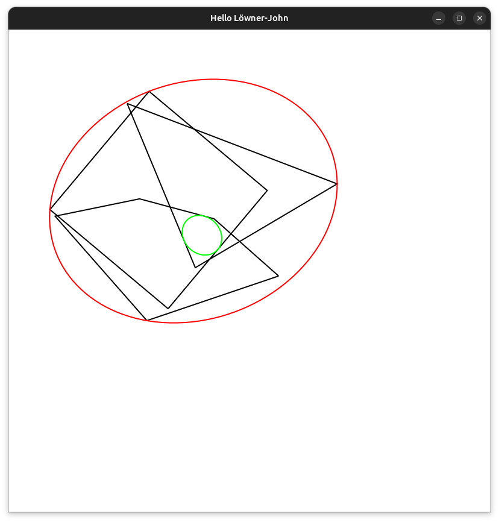
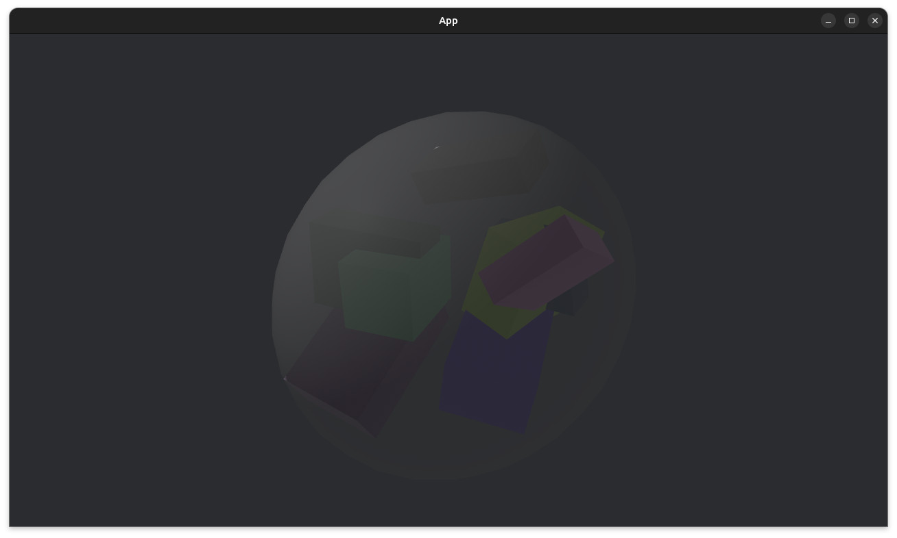
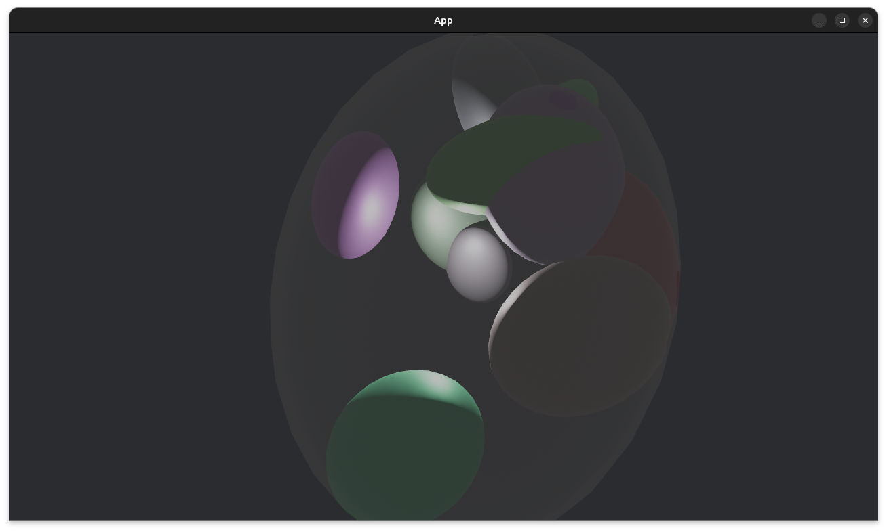
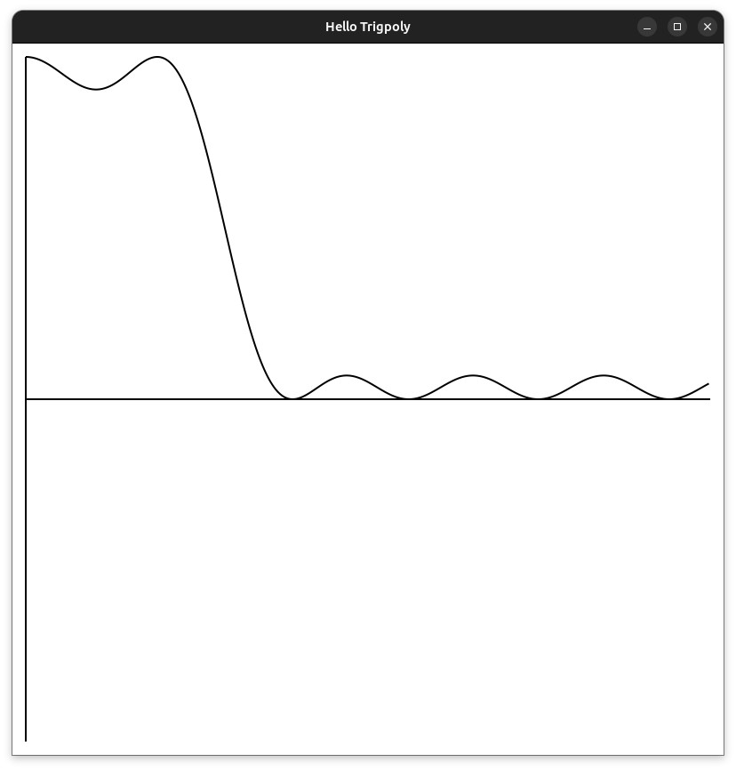
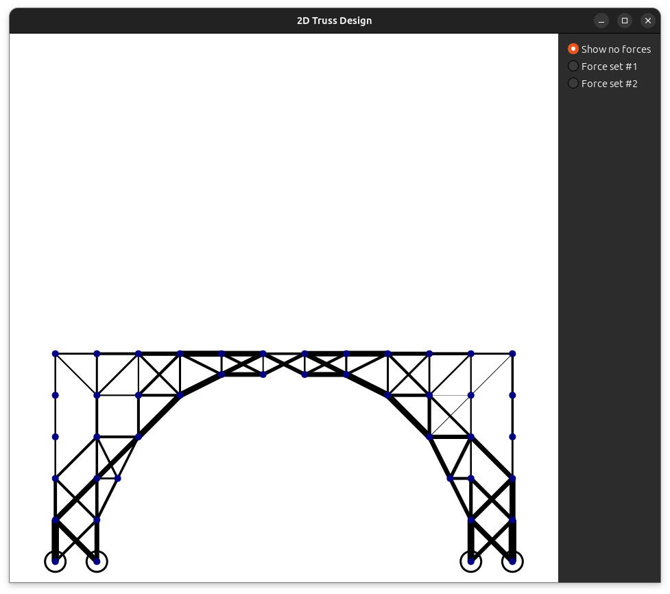

[](https:/crates.io/crates/mosekcomodel)&nbsp;
[](https://github.com/mosek/mosekcomodel.rust)&nbsp;
[](https://docs.rs/mosekcomodel)
 

**This is a pre-release of the `MosekCOModel` project. It is provided with
absolutely no official support and is still to be considered highly
experimenental.**

# MosekCOModel

The `MosekCOModel` crate is a modeling package for building optimization models
with `Mosek.rs`. The [Mosek.rs](https://crates.io/crates/mosek) package is a
relatively thin interface in top of low-level [MOSEK](https://mosek.com)
optimizer C API, where `MosekModel` is an attempt to create an interface that
is more like the MOSEK Fusion modelling interface.

Published crates: https://crates.io/crates/mosekcomodel

Documentation for latest crates: https://docs.rs/mosekcomodel/latest/mosekcomodel/

# Design principle
`MosekModel` allows building a model of the form
```
min/max   c^t x + c_fix
such that Ax_b ∊ K_c
          x ∊ K_x  
```
That is affine expressions and conic domains of constraints and variables.

The `MosekModel` package provides functionality to build the linear expressions.

# Simple conic example
Implementing the models
```
minimize y₁ + y₂ + y₃
such that
         x₁ + x₂2 + 2.0 x₃ = 1.0
                  x₁,x₂,x₃ ≥ 0.0
and
         (y₁,x₁,x₂) in C₃,
         (y₂,y₃,x₃) in K₃
```

where `C₃` and `K₃` are respectively the quadratic and
rotated quadratic cone of size 3 defined as
```
    C₃ = { z₁,z₂,z₃ :      z₁ ≥ √(z₂² + z₃²) }
    K₃ = { z₁,z₂,z₃ : 2 z1 z₂ ≥ z₃²          }
```

This is the included model `cqo1.rs`:

```rust
extern crate mosekcomodel;
use mosekcomodel::*;
use mosekcomodel::expr::*;

fn main() {
    let mut m = Model::new(Some("cqo1"));
    let x = m.variable(Some("x"), greater_than(vec![0.0;3]));
    let y = m.variable(Some("y"), 3);

    // Create the aliases
    //      z1 = [ y[0],x[0],x[1] ]
    //  and z2 = [ y[1],y[2],x[2] ]

    let z1 = Variable::vstack(&[&y.index(0..1), &x.index(0..2)]);
    let z2 = Variable::vstack(&[&y.index(1..3), &x.index(2..3)]);

    // Create the constraint
    //      x[0] + x[1] + 2.0 x[2] = 1.0
    let aval = &[1.0, 1.0, 2.0];
    let _ = m.constraint(Some("lc"), aval.dot(x.clone()), equal_to(1.0));

    // Create the constraints
    //      z1 belongs to C_3
    //      z2 belongs to K_3
    // where C_3 and K_3 are respectively the quadratic and
    // rotated quadratic cone of size 3, i.e.
    //                 z1[0] >= sqrt(z1[1]^2 + z1[2]^2)
    //  and  2.0 z2[0] z2[1] >= z2[2]^2
    let qc1 = m.constraint(Some("qc1"), &z1, in_quadratic_cone(3));
    let _qc2 = m.constraint(Some("qc2"), &z2, in_rotated_quadratic_cone(3));

    // Set the objective function to (y[0] + y[1] + y[2])
    m.objective(Some("obj"), Sense::Minimize, y.sum());

    // Solve the problem
    m.solve();

    // Get the linear solution values
    let solx = m.primal_solution(SolutionType::Default,&x);
    let soly = m.primal_solution(SolutionType::Default,&y);
    println!("x = {:?}", solx);
    println!("y = {:?}", soly);

    // Get primal and dual solution of qc1
    let qc1lvl = m.primal_solution(SolutionType::Default,&qc1);
    let qc1sn  = m.dual_solution(SolutionType::Default,&qc1);

    println!("qc1 levels = {:?}", qc1lvl);
    println!("qc1 dual conic var levels = {:?}", qc1sn);
}
```

# Compiling, testing, running

First, to build simply type 
```sh
cargo build
```
Optionally, also pass the `--release` flag as the Debug build is significantly slower that the release build.

Running examples requires the MOSEK library to be available and a valid MOSEK license file. The simplest
solution is to download and unpack the MOSEK distro from [MOSEK Downloads](https://www.mosek.com/downloads/), unpack the distro
and set relevant environment variable:
- On MS Windows: 
  ```set PATH=C:\full\path\to\mosek\binaries;%PATH%```
- On Mac OSX: 
  ```export DYLD_LIBRARY_PATH=/full/path/to/mosek/binaries:$DYLD_LIBRARY_PATH```
- On Linux: 
  ```export LD_LIBRARY_PATH=/full/path/to/mosek/binaries:$LD_LIBRARY_PATH```

To run tests, do 
```sh
cargo test --all
```

A trial license can be obtained from [MOSEK Trial license](https://www.mosek.com/products/trial/).

## Demos

The project also contanis a set of graphical demos. These are in separate
sub-projects in `examples/demos` since they depend on a lot of external
libraries.

To run these, go to the sub-folder with demos
```sh
cd examples/demos
```
Then to run, say `lowner-john-2d`, do 
```sh 
cargo run --release -p lowner-john-2d
```

### `lowner-john-2d` 

For a set of moving, rotating polygons, computes the minimal
bounding ellipsoid containing all polygons (or, in fact all corner points),
and the maximum ellipsoid contained in the intersection (when the
intersection is non-empty). 



### `lowner-john-outer-3d` 

For a set of rotating and moving polyhedrons, compute
the minimal bounding ellipsoid containing all polyhedrons (or their corner
points).



### `ellipsoid-approximation` 

For a set of moving and rotating ellipses,
compute the outer approximation (minimal ellipse containing all moving
ellipses), and inner approximation (maximum ellipe contained in the
intersection of all ellipses).



### `ellipsoid-approximation-3d` 
For a set of moving and rotating ellipsoids, compute the minimal bounding ellipsoid.


### `trigpoly` 
Simple visualization of trigonometric polynomial optimization.



### `truss` 
Simple 2D truss design model assigning material to bars in a truss construction. This requires a data file, e.g.

```sh 
cargo run --release -p truss -- truss/data/bridge.trs
```




